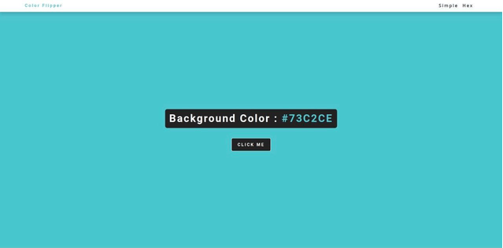

# Color-Picker

## Sobre o exercício 

O exercício consiste em usar Javascript para fazer com que o botão consiga trocar a cor do fundo da página, identificando a cor pelo nome, por código RGB ou por código hexadecimal.

## Preview

  
  

